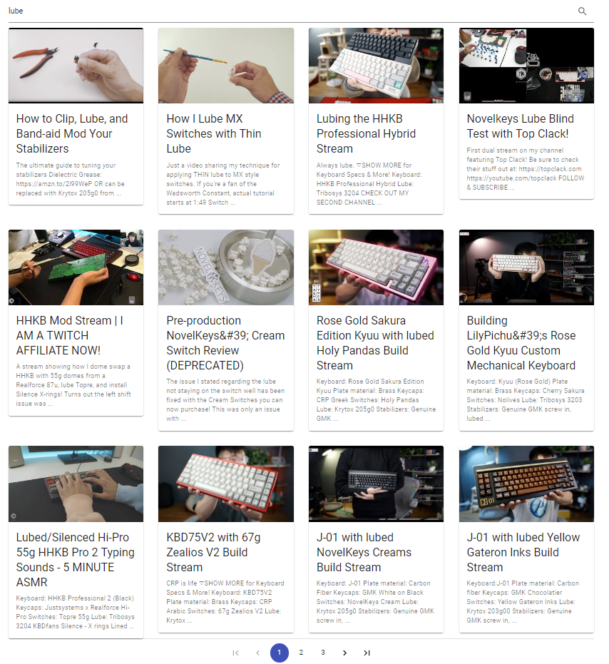

# Youtube Videos Lister of my favorite youtube channel Web Application

---

step 1: install all dependencies

```
cd client
npm install

cd server
npm install

npm run dev
```

# Description

Simple full stack application that retrieves and consumes youtube api and then abstracts important pieces of information for frontend to utilize.

# Images




